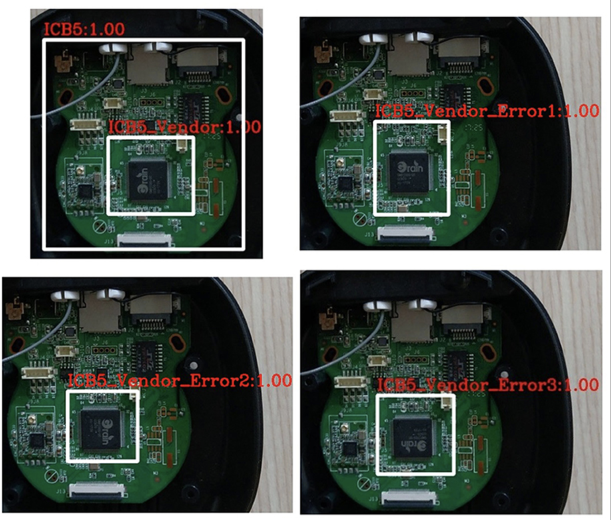

# Week 2 – Object Detection

## Overview

This task focused on performing object detection using pretrained YOLO models from the Ultralytics framework.

The workflow included:
- creating a Python virtual environment,
- installing Ultralytics YOLO,
- performing object detection on PCB images,
- and generating annotated outputs with bounding boxes.

---

## Tasks Completed

- Created Python virtual environment using `venv`
- Installed Ultralytics YOLO
- Performed object detection using pretrained YOLOv8 model
- Applied detection on PCB images
- Generated annotated detection outputs
- Learned AI-based object detection workflow for electronic component analysis

---

## Tools Used

- Python
- Ultralytics YOLO
- OpenCV
- macOS Terminal

---

## Detection Workflow

```text
Input PCB Image
        ↓
YOLO Object Detection
        ↓
Bounding Box Prediction
        ↓
Annotated Output
```

---

## Sample Detection Script

```python
from ultralytics import YOLO

# Load pretrained YOLO model
model = YOLO("yolov8n.pt")

# Run object detection
results = model(
    "pcb_image.jpg",
    save=True
)

print("Object Detection Completed")
```

---

## Sample Detection Output

The following image shows YOLO-based electronic component detection and PCB analysis.



---

## Concepts Learned

- Object Detection
- Bounding Box Prediction
- Deep Learning Inference
- PCB Component Analysis
- AI-based Inspection Systems

---

## Output

Successfully performed object detection using YOLOv8 pretrained models and generated annotated PCB detection outputs.
