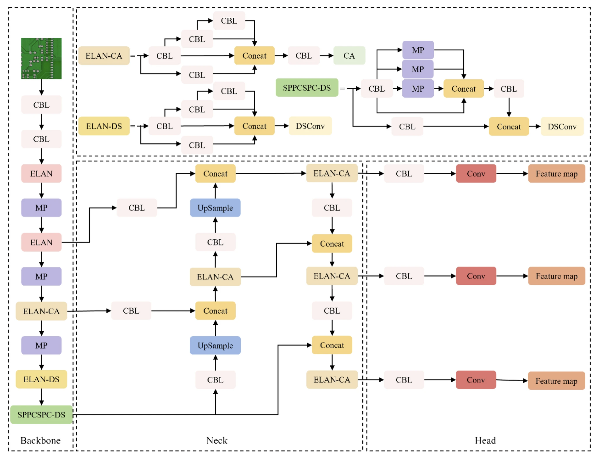

# Week 4 – Dataset Preparation

## Overview

This task focused on preparing datasets and understanding model training workflows for computer vision applications using the YOLO framework.

The workflow included:
- understanding dataset organization,
- preparing annotations,
- generating train and validation splits,
- and exploring AI model architectures used for PCB inspection systems.

---

## Tasks Completed

- Explored YOLO dataset structure
- Understood annotation and label formats
- Created custom annotations using Label Studio
- Prepared train and validation datasets
- Learned dataset preprocessing workflows for AI training
- Studied model pipeline architecture for computer vision systems

---

## Tools Used

- Label Studio
- Python
- YOLO Dataset Format
- OpenCV
- NumPy

---

## Dataset Workflow

```text
Input Images
      ↓
Annotation & Labeling
      ↓
YOLO Label Generation
      ↓
Train / Validation Split
      ↓
Model Training Dataset
```

---

## Example Dataset Preparation

The following diagram represents the AI model pipeline and dataset processing workflow used for computer vision training and PCB inspection tasks.



---

## Concepts Learned

- Dataset Annotation
- YOLO Label Format
- Data Organization
- Train / Validation Splitting
- AI Dataset Engineering
- Deep Learning Workflow Design

---

## Sample YOLO Folder Structure

```text
dataset/
│
├── images/
│   ├── train/
│   └── val/
│
├── labels/
│   ├── train/
│   └── val/
│
└── data.yaml
```

---

## AI Pipeline Components

- Backbone Network
- Feature Extraction
- Neck Architecture
- Detection Head
- Multi-scale Feature Mapping

---

## Output

Successfully prepared datasets and explored AI model training workflows for PCB inspection and computer vision applications using the YOLO framework.
