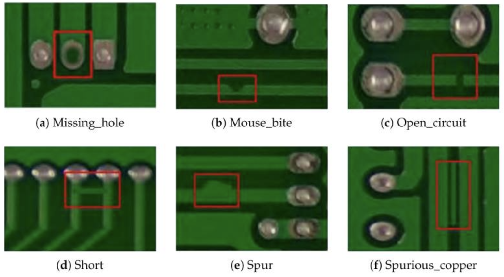

# Week 5 – ECIS Project

# ECIS – Electronic Component Intelligence System

## Overview

ECIS is a computer vision based inspection system designed for intelligent analysis of electronic components and PCB defects using deep learning and OCR techniques.

The project combines:
- object detection,
- OCR,
- defect analysis,
- and component classification
into a unified AI workflow for automated electronic inspection systems.

---

## Project Goals

- Detect electronic components using YOLO
- Identify PCB defects automatically
- Extract part numbers using OCR
- Perform visual inspection using AI
- Generate annotated outputs for analysis

---

## Features

- PCB defect detection
- Electronic component identification
- AI-based inspection workflow
- Bounding box prediction
- Deep learning inference pipeline
- Visual defect localization

---

## Example PCB Defects

The following image shows common PCB manufacturing defects analyzed using computer vision techniques.



---

## Defect Types

- Missing Hole
- Mouse Bite
- Open Circuit
- Short Circuit
- Spur
- Spurious Copper

---

## ECIS Workflow

```text
Input PCB Image
        ↓
Component Detection using YOLO
        ↓
OCR-based Text Extraction
        ↓
Defect Detection & Analysis
        ↓
Final Inspection Output
```

---

## Technologies Used

- Python
- OpenCV
- Ultralytics YOLO
- EasyOCR
- NumPy

---

## Concepts Learned

- Object Detection
- Semantic Segmentation
- OCR Integration
- PCB Inspection
- AI-based Visual Analysis
- Deep Learning Workflow Design

---

## Future Scope

- Real-time PCB inspection
- Embedded AI deployment
- Streamlit dashboard integration
- Industrial automation systems
- Advanced anomaly detection
- Large-scale electronic component datasets

---

## Output

Successfully designed a conceptual AI-based PCB inspection system using YOLO, OCR, and computer vision techniques for intelligent electronic component analysis.
